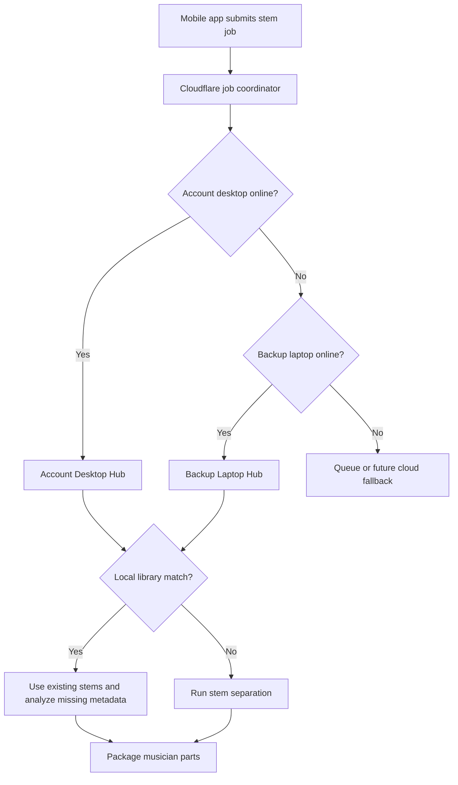

# CineStage Desktop Stem Hub

## Goal

CineStage Desktop Stem Hub turns an account holder desktop, backup laptop, or local library server into the heavy-processing node for stem jobs.

The mobile apps submit a stem request. Cloudflare coordinates the job. The desktop hub searches local/external storage first, then only runs stem separation when reusable stems are missing.

## Processing Priority



## Folder Structure

The hub organizes stems into a human-readable library:

```text
CineStage Stem Library/
  Artist or Band/
    Album or Collection/
      Song Title/
        original/
        stems/
        charts/
        metadata/
        exports/
```

The folder library stores the media. The local index stores searchable metadata for fast matching.

## First Implementation

Implemented in `apps/ultimate_daw`:

- `CineStage Hub` desktop screen.
- Worker identity and sync URL settings.
- Account desktop, backup laptop, and library server modes.
- External/shared library root selection.
- Local scan/index of stems, charts, and metadata.
- Folder preview and folder creation.
- Library match testing.
- Start/stop for the background stem worker.
- Stem worker searches the local index before running Demucs.
- New stem jobs are written into the organized Artist/Album/Song workspace.

## Matching Rules

The first matching layer uses:

- title
- artist/band
- album/collection
- song/source id when available
- stem availability
- key/BPM metadata availability

Future upgrades should add audio fingerprinting, stronger duplicate detection, and automatic metadata analysis for key, BPM, sections, waveform, chords, and lyrics.

## Product Rules

- The hard drive is media storage, not the database.
- The local index is the searchable catalog.
- Cloudflare stores job state and lightweight registry data.
- Desktop/laptop workers do heavy processing.
- Mobile apps receive ready status and musician-specific packages.
- Service exports should expire after the service plus the configured TTL, defaulting to 2 hours.
