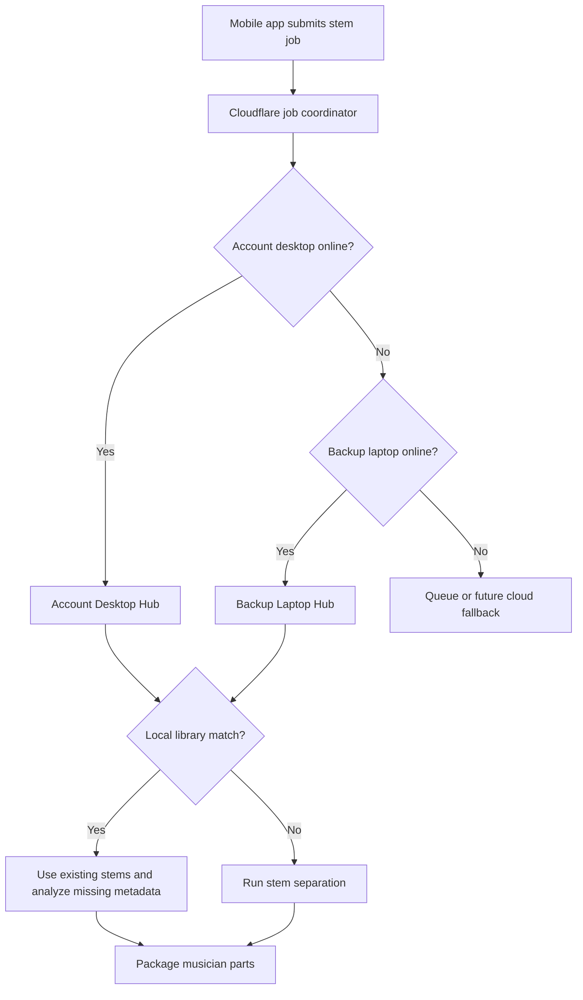

# CineStage Desktop Stem Hub

## Goal

CineStage Desktop Stem Hub turns an account holder desktop, backup laptop, or local library server into the heavy-processing node for stem jobs.

The mobile apps submit a stem request. Cloudflare coordinates the job. The desktop hub searches local/external storage first, then only runs stem separation when reusable stems are missing.

## Processing Priority



## Folder Structure

The hub organizes stems into a human-readable library:

```text
CineStage Stem Library/
  Artist or Band/
    Album or Collection/
      Song Title/
        original/
        stems/
        charts/
        metadata/
        exports/
```

The folder library stores the media. The local index stores searchable metadata for fast matching.

## First Implementation

Implemented in `apps/ultimate_daw`:

- `CineStage Hub` desktop screen.
- Worker identity and sync URL settings.
- Account desktop, backup laptop, and library server modes.
- External/shared library root selection.
- Local scan/index of stems, charts, and metadata.
- Flat Ableton-style folders such as `MultiTracks`, `Imported`, and `stems` are grouped as one song/project instead of one song per WAV file.
- Recovered VS/multitrack folder names such as `GUIA`, `VOZ`, `SOPRANO`, `CONTRALTO`, `TENOR`, `VIOLAO`, `ACG`, `EG`, `GTR`, `CORDAS`, `CLICK136`, and `Bpm136` are recognized as guide, vocal, guitar, keys, click, and metadata signals.
- Folder preview and folder creation.
- Library match testing.
- Start/stop for the background stem worker.
- Stem worker searches the local index before running Demucs.
- New stem jobs are written into the organized Artist/Album/Song workspace.
- Optional audio analyzer for BPM, key, waveform, and coarse sections, adapted from older iCloud CineStage pipeline files.

## iCloud Versions Reviewed

Relevant existing versions found on this machine:

- `~/Library/Mobile Documents/com~apple~CloudDocs/Ultimate Ecosystem /Utimate Musician app/Ultimate_Workspace/UltimateMusicianDesktop`
  - Older Electron desktop shell with Cloudflare API notes.
  - Useful as history, but the repo `apps/ultimate_daw` is the cleaner desktop base.
- `~/Library/Mobile Documents/com~apple~CloudDocs/Ultimate Ecosystem /Utimate Musician app/UltimateMusicianDAW`
  - Python DAW/backend prototype with tracks, clips, transport, MIDI, effects, and export routers.
  - Useful later for DAW/audio engine ideas, not the first stem-hub path.
- `~/Library/Mobile Documents/com~apple~CloudDocs/Ultimate Ecosystem /Cinestage/pipeline`
  - Tempo, key, chord, waveform, and structure detector prototypes.
  - The first desktop analyzer was adapted from these files.
- `~/Library/Mobile Documents/com~apple~CloudDocs/Ultimate Ecosystem /Cinestage/CineStage_Music_AI`
  - Larger Python music AI service with Demucs stem separator, vocal harmony, instrument chart, MIDI preset, mix intelligence, and device adapters.
  - Best next source for advanced stem quality metrics, chart generation, MIDI/preset exports, and device-aware musician packages.
- `~/Library/Mobile Documents/com~apple~CloudDocs/Ultimate Ecosystem /Cinestage`
  - Multiple terminal/server builds, Modal Demucs experiments, Cloudflare R2 setup notes, waveform plans, and assistant architecture notes.
  - Useful as a reference library, but code should be harvested selectively into the current repo.

## Matching Rules

The first matching layer uses:

- title
- artist/band
- album/collection
- song/source id when available
- stem availability
- key/BPM metadata availability

Future upgrades should add audio fingerprinting, stronger duplicate detection, and automatic metadata analysis for key, BPM, sections, waveform, chords, and lyrics.

## Local VS Recovery

On this machine, recovered VS assets were moved from Trash into:

```text
/Users/studio/Downloads/VS
```

The active local Hub roots should prefer this specific folder instead of the parent `Downloads` folder. Scanning both `Downloads` and `Downloads/VS` creates duplicate records because the parent folder contains the child folder.

Last local scan after VS recovery:

- `282` files scanned.
- `9` song projects indexed.
- `82` stem types found.
- High-value projects include `Eu Me Rendo Renaser`, `MT - Te louvarei`, `MULTITRACKS - UM NOVO DIA _151BPM`, `Sara Oliveira - Caia Fogo - Bb - Bpm136`, `Sued Silva - O Nome Dele Jesus`, and `Julliany Souza - Quem e Esse - F# - Bpm124`.

## Product Rules

- The hard drive is media storage, not the database.
- The local index is the searchable catalog.
- Cloudflare stores job state and lightweight registry data.
- Desktop/laptop workers do heavy processing.
- Mobile apps receive ready status and musician-specific packages.
- Service exports should expire after the service plus the configured TTL, defaulting to 2 hours.

## Desktop Live And Setlist Repair

August 8, 2026 desktop audit fixes:

- `apps/ultimate_daw` now uses the live Cloudflare Worker URL instead of the older Pages URL.
- Cloudflare Worker now exposes `/sync/live-status` for Live Performance GET/POST state.
- Setlist Runner publishes the active song to `/sync/live-status` when the runner starts/stops or changes songs.
- Live Performance now shows a clear offline state when nothing is live instead of rendering an empty live screen.
- Setlist and Setlist Runner now accept the Worker array response from `/sync/setlist`.
- Assignment service resolution now prefers `service_id` before assignment `id`, avoiding `service_person` ids being used as service ids.
- Pending assignment rows are treated as valid rehearsal/run access until the musician responds.
- Worker now exposes `/sync/services` plus service proposal approve/reject routes used by the desktop Admin and Leader dashboards.

August 8, 2026 app-to-desktop linkage fixes:

- Desktop Hub worker auto-starts when `apps/ultimate_daw` launches unless `autoStartWorker` is disabled in Hub config.
- Desktop heartbeat derives account email/account id from the signed-in desktop user/profile when Hub fields are empty.
- Desktop heartbeat now reports worker mode and backup-worker permission to Cloudflare.
- Cloudflare stem routing now chooses the exact account desktop first, then an online backup/library worker, then Cloudflare fallback.
- Ultimate Playback and Ultimate Musician can use `/sync/cinestage/desktops`, `/sync/service-readiness`, and `/sync/stem-jobs` to show whether stems are routed to desktop or fallback.
- Smoke verification: a stem job from `xxmineiroxx@gmail.com` routed to online `desktop_MacBook-Pro` with `processor: desktop`, then was rejected as cleanup.
