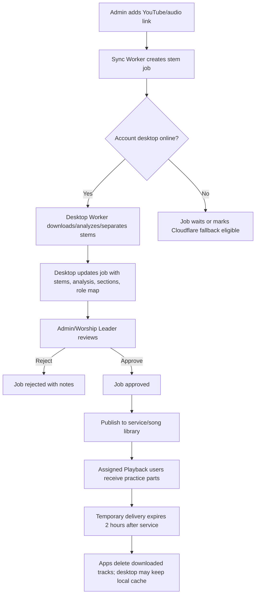

# CineStage Desktop Stem Worker

## Decision

CineStage stem processing should be desktop-primary for each account holder.

The account holder's desktop app is the heavy-processing node. iPad and mobile apps create, monitor, review, and consume jobs, but they should not be responsible for full YouTube download, Demucs stem separation, waveform analysis, or large file preparation.

Cloudflare Workers stay in the middle as the sync coordinator and metadata store. Cloudflare fallback is used only when no desktop processor is available for the account.

Stems are not a website catalog in this phase. They are temporary service delivery packages. The account holder can keep a reusable local copy on their desktop, mini PC/Mac, or external hard drive, but the app should not store stem inventory on a public website until a future MultiTracks-style marketplace/product is intentionally built.

## Roles

- Ultimate Musician iPad/Desktop: creates stem jobs, reviews output, approves publishing.
- CineStage Desktop Worker: downloads source audio, separates stems, analyzes BPM/key/sections/cues, uploads or exposes stem assets, and updates job status.
- Ultimate Playback: receives approved practice parts for the logged-in musician's assigned role.
- Cloudflare Sync Worker: stores jobs, desktop heartbeats, status, approvals, published metadata, and team notifications.

## Flow

## Implemented Sync Surface

- `POST /sync/cinestage/desktop-heartbeat`
  - Desktop app announces it is online and capable of stem processing.
- `GET /sync/cinestage/desktops`
  - Lists known desktop workers.
- `POST /sync/stem-jobs`
  - Creates a desktop-primary stem job from a YouTube/audio link.
- `GET /sync/stem-jobs?status=&processor=&ownerEmail=&serviceId=`
  - Lists jobs for Admin/iPad/Desktop.
- `GET /sync/stem-job?id=...`
  - Gets one job.
- `POST /sync/stem-job/update?id=...`
  - Desktop updates progress, status, stems, waveform/analysis, sections, and role mapping.
- `POST /sync/stem-job/approve?id=...`
  - Admin/Worship Leader approves prepared stems.
- `POST /sync/stem-job/publish?id=...`
  - Publishes approved stems into the song library/service plan and messages assigned team members.
- `POST /sync/stem-jobs/cleanup`
  - Finds or cleans expired temporary stem delivery metadata after the service retention window.
- `POST /sync/stem-job/reject?id=...`
  - Rejects a stem job with notes.

## Job States

- `queued_for_desktop`: desktop is online and should process.
- `waiting_for_desktop`: no desktop processor is online.
- `cloudflare_fallback`: job is allowed to be picked up by a fallback processor later.
- `processing`: desktop is working.
- `completed` or `ready_for_review`: stems and analysis are ready for inspection.
- `approved`: Admin/Worship Leader approved output.
- `published`: approved output is available to assigned Playback users.
- `expired`: temporary playback delivery has passed the cleanup window.
- `rejected`: output should not be used.
- `failed`: processing failed.

## Output Package

The desktop worker should update the job with:

- `stems`: role-neutral stem files, such as `vocals`, `drums`, `bass`, `guitar`, `piano`, `other`.
- `analysis`: BPM, key, waveform peaks, confidence, source metadata.
- `sections`: intro, verse, chorus, bridge, altar, ending, or other worship sections.
- `cueMarkers`: rehearsal/live cue markers.
- `roleStemMap`: which stems each role should receive.
- `readiness`: downloaded, separated, analyzed, mappedToRoles.
- `retention`: delivery expiration, cleanup status, and local-cache policy.
- `localCache`: optional account-holder cache metadata for faster future reuse.

## Retention Policy

Default policy:

- Stems are temporary delivery assets.
- Stems should be available to assigned apps through the service window.
- Two hours after the service ends, temporary app downloads and temporary delivery links should be deleted.
- Cloudflare keeps only metadata needed for audit/history unless the account explicitly uses fallback/cloud storage.
- The account holder may save stems locally on the desktop, mini PC/Mac, or an external drive.
- Local saved stems can be recognized by a cache key next time the same song is used, making the next publish faster.

Important fields:

- `retention.mode`: `ephemeral_delivery`
- `retention.deleteAfterServiceHours`: defaults to `2`
- `retention.expiresAt`: set when the job is published
- `retention.cleanupStatus`: `not_published`, `scheduled`, or `cleaned`
- `retention.websiteCatalogEligible`: `false`
- `localCache.status`: `saved`, `missing`, `unknown`
- `localCache.cacheKey`: reusable local song/stem identity
- `localCache.localPath`: desktop-only path; do not expose to Playback users
- `localCache.externalDrive`: whether the account holder saved it to an external drive

## Product Rules

- Desktop does the hard work when available.
- Cloudflare coordinates jobs but should not be treated as the default heavy processor.
- iPad can create/review/approve jobs, but should not depend on local heavy stem separation.
- Playback receives only approved/published outputs.
- Playback must delete or invalidate temporary downloaded tracks after the retention window.
- Anything derived by AI or audio analysis requires Admin/Worship Leader review before the team receives it.
- Large audio files should stay on the account holder desktop, mini PC/Mac, external drive, or temporary delivery storage. GitHub stores code and metadata only.
- Do not build public stem storage or a MultiTracks-style website catalog until that product is explicitly planned.

## Next Implementation Step

Build the desktop worker loop:

1. Send heartbeat every 60 seconds.
2. Poll `GET /sync/stem-jobs?processor=desktop&status=queued_for_desktop`.
3. Download/prepare source audio.
4. Run Demucs stem separation.
5. Run BPM/key/section/waveform analysis.
6. Upload or expose stem assets.
7. Call `POST /sync/stem-job/update?id=...` with `status: ready_for_review`.
8. Save local cache metadata if the account holder keeps the processed song.
9. After service expiration, call `POST /sync/stem-jobs/cleanup` and delete temporary local/app delivery copies.
