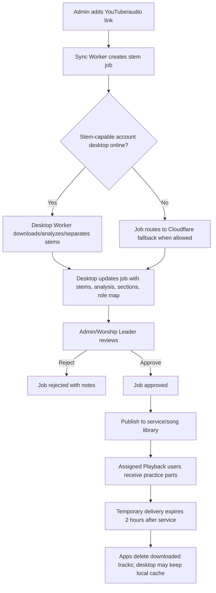

# CineStage Desktop Stem Worker

## Decision

CineStage stem processing should be desktop-primary for each account holder.

The account holder's desktop app is the heavy-processing node. iPad and mobile apps create, monitor, review, and consume jobs, but they should not be responsible for full YouTube download, Demucs stem separation, waveform analysis, or large file preparation.

Cloudflare Workers stay in the middle as the sync coordinator and metadata store. Cloudflare fallback is used only when no stem-capable desktop processor is online for the account.

Stems are not a website catalog in this phase. They are temporary service delivery packages. The account holder can keep a reusable local copy on their desktop, mini PC/Mac, or external hard drive, but the app should not store stem inventory on a public website until a future MultiTracks-style marketplace/product is intentionally built.

## Roles

- Ultimate Musician iPad/Desktop: creates stem jobs, reviews output, approves publishing.
- CineStage Desktop Worker: downloads source audio, separates stems, analyzes BPM/key/sections/cues, uploads or exposes stem assets, and updates job status.
- Ultimate Playback: receives approved practice parts for the logged-in musician's assigned role.
- Cloudflare Sync Worker: stores jobs, desktop heartbeats, status, approvals, published metadata, and team notifications.

## Flow



## Implemented Sync Surface

- `GET /sync/cinestage/brain`
  - Canonical CineStage Brain source-of-truth snapshot for apps. Includes selected stem route, selected desktop worker, desktop presence, Brain authority flags, queue counts, and online processor state.
- `POST /sync/cinestage/desktop-heartbeat`
  - Desktop app announces it is online and capable of stem processing.
- `GET /sync/cinestage/desktops`
  - Diagnostic list of known desktop workers. App UX should prefer `/sync/cinestage/brain` for route decisions.
- `POST /sync/stem-jobs`
  - Creates a desktop-primary stem job from a YouTube/audio link. If a capable desktop is online, the job becomes `queued_for_desktop`; if no capable desktop is online and fallback is allowed, it becomes `cloudflare_fallback`.
- `POST /sync/stem-job/claim?id=...`
  - Desktop claims one queued job before processing. Claims include a lease so only one desktop processes a job at a time, and stale claims can be reclaimed.
- `GET /sync/stem-jobs?status=&processor=&ownerEmail=&serviceId=`
  - Lists jobs for Admin/iPad/Desktop.
- `GET /sync/stem-job?id=...`
  - Gets one job.
- `POST /sync/stem-job/update?id=...`
  - Desktop updates progress, status, stems, waveform/analysis, sections, and role mapping.
- `POST /sync/stem-job/approve?id=...`
  - Admin/Worship Leader approves prepared stems.
- `POST /sync/stem-job/publish?id=...`
  - Publishes approved stems into the song library/service plan and messages assigned team members.
- `POST /sync/stem-jobs/cleanup`
  - Finds or cleans expired temporary stem delivery metadata after the service retention window.
- `POST /sync/stem-job/reject?id=...`
  - Rejects a stem job with notes.
- `POST /sync/stem-assets/upload?id=...&type=...&filename=...`
  - Desktop uploads a processed stem into temporary R2 delivery storage when `STEM_ASSETS` is configured.
- `GET /sync/stem-assets/download?id=...&type=...`
  - Playback/iPad downloads an approved or reviewable stem asset from temporary R2 delivery storage.
- `POST /sync/stems/upload?uploadId=...&filename=...`
  - iPhone/iPad uploads licensed local source audio so the desktop can download and process it.
- `GET /sync/stem-sources/download?uploadId=...`
  - Desktop downloads the uploaded source audio for processing.

## Job States

- `queued_for_desktop`: desktop is online and should process.
- `waiting_for_desktop`: no desktop processor is online and fallback was explicitly disabled.
- `waiting_for_source`: desktop is online, but the job needs licensed/local source audio or a compliant YouTube preparation step.
- `cloudflare_fallback`: job is allowed to be picked up by a fallback processor later.
- `processing`: desktop is working.
- `completed` or `ready_for_review`: stems and analysis are ready for inspection.
- `approved`: Admin/Worship Leader approved output.
- `published`: approved output is available to assigned Playback users.
- `expired`: temporary playback delivery has passed the cleanup window.
- `rejected`: output should not be used.
- `failed`: processing failed.

## CineStage Cloud Status UI

Ultimate Playback and Ultimate Musician now read `/sync/cinestage/brain` and show the stem route selected by CineStage Brain. The desktop list remains available for diagnostics.

- Green route: a stem-capable desktop heartbeat was seen in the last five minutes, so new stem jobs go to desktop processing.
- Amber route: no capable desktop is online, so new stem jobs move to the fallback lane when fallback is allowed.
- The detailed cloud screen lists online desktop workers with queue depth and active-job state.

## Output Package

The desktop worker should update the job with:

- `stems`: role-neutral stem files, such as `vocals`, `drums`, `bass`, `guitar`, `piano`, `other`.
- `analysis`: BPM, key, waveform peaks, confidence, source metadata.
- `sections`: intro, verse, chorus, bridge, altar, ending, or other worship sections.
- `cueMarkers`: rehearsal/live cue markers.
- `roleStemMap`: which stems each role should receive.
- `readiness`: downloaded, separated, analyzed, mappedToRoles.
- `retention`: delivery expiration, cleanup status, and local-cache policy.
- `localCache`: optional account-holder cache metadata for faster future reuse.

## Retention Policy

Default policy:

- Stems are temporary delivery assets.
- Stems should be available to assigned apps through the service window.
- Two hours after the service ends, temporary app downloads and temporary delivery links should be deleted.
- Cloudflare keeps only metadata needed for audit/history unless the account explicitly uses fallback/cloud storage.
- The account holder may save stems locally on the desktop, mini PC/Mac, or an external drive.
- Local saved stems can be recognized by a cache key next time the same song is used, making the next publish faster.

Important fields:

- `retention.mode`: `ephemeral_delivery`
- `retention.deleteAfterServiceHours`: defaults to `2`
- `retention.expiresAt`: set when the job is published
- `retention.cleanupStatus`: `not_published`, `scheduled`, or `cleaned`
- `retention.websiteCatalogEligible`: `false`
- `localCache.status`: `saved`, `missing`, `unknown`
- `localCache.cacheKey`: reusable local song/stem identity
- `localCache.localPath`: desktop-only path; do not expose to Playback users
- `localCache.externalDrive`: whether the account holder saved it to an external drive

## Product Rules

- Desktop does the hard work when available.
- Cloudflare coordinates jobs but should not be treated as the default heavy processor.
- iPad can create/review/approve jobs, but should not depend on local heavy stem separation.
- Playback receives only approved/published outputs.
- Playback must delete or invalidate temporary downloaded tracks after the retention window.
- Anything derived by AI or audio analysis requires Admin/Worship Leader review before the team receives it.
- Large audio files should stay on the account holder desktop, mini PC/Mac, external drive, or temporary delivery storage. GitHub stores code and metadata only.
- Do not build public stem storage or a MultiTracks-style website catalog until that product is explicitly planned.

## Next Implementation Step

The first desktop worker loop now exists in `apps/ultimate_daw/src/main/workers/stemJobWorker.js`.

Run it from the desktop app folder:

```bash
cd apps/ultimate_daw
UM_SYNC_URL="https://your-sync-worker.example" \
UM_ACCOUNT_EMAIL="account@example.com" \
npm run worker:stems
```

For a single poll/processing pass:

```bash
cd apps/ultimate_daw
UM_STEM_RUN_ONCE=true \
UM_SYNC_URL="https://your-sync-worker.example" \
UM_ACCOUNT_EMAIL="account@example.com" \
npm run worker:stems:once
```

Supported environment:

- `UM_SYNC_URL`: Cloudflare sync Worker base URL.
- `UM_ACCOUNT_EMAIL`: account holder email used to match queued desktop jobs.
- `UM_ACCOUNT_ID`: optional account/org ID.
- `UM_DESKTOP_ID`: stable desktop worker ID. Defaults to the machine hostname.
- `UM_DESKTOP_NAME`: display name in Admin/iPad status views.
- `UM_STEM_CACHE_DIR`: local cache root. Defaults to `~/Music/Ultimate Musician/Stem Cache`.
- `UM_STEM_MODEL`: Demucs model. Defaults to `htdemucs_6s`.
- `UM_STEM_POLL_INTERVAL_MS`: job poll interval. Defaults to 60000.
- `UM_STEM_ALLOW_YOUTUBE_DOWNLOAD`: off by default. Keep off unless a compliant source-prep/downloader is configured.

Current worker behavior:

1. Send heartbeat every 60 seconds.
2. Poll `GET /sync/stem-jobs?processor=desktop&status=queued_for_desktop`.
3. If no queued job exists, poll expired `processing` claims and reclaim stale work.
4. Claim a job through `POST /sync/stem-job/claim?id=...` before processing.
5. Download direct audio URLs or use local/file URLs as source audio.
6. Run Demucs stem separation.
7. Upload processed stems to `/sync/stem-assets/upload` when Cloudflare R2 is configured.
8. Save stems and a manifest in the account holder's local cache.
9. Call `POST /sync/stem-job/update?id=...` with `status: ready_for_review`.
10. Include `roleStemMap`, readiness flags, and local cache metadata.
11. Call `POST /sync/stem-jobs/cleanup` so expired published jobs clear temporary metadata and R2 objects.

## Cloudflare R2 Delivery

The sync Worker now supports optional R2-backed temporary delivery. Add an R2 bucket binding named `STEM_ASSETS` to the deployed Cloudflare Worker.

Example `wrangler.toml` binding:

```toml
[[r2_buckets]]
binding = "STEM_ASSETS"
bucket_name = "ultimate-stem-assets"
```

If R2 is not configured, the upload endpoints return `501` and the desktop worker falls back to `delivery: local_cache_only` with `downloadable: false`. That fallback is deliberate so Playback does not pretend a local desktop path can be downloaded by an iPad.

When R2 is configured:

- iPhone/iPad local source uploads go to R2 through `/sync/stems/upload`.
- Desktop downloads the source URL and processes stems.
- Desktop uploads each processed stem through `/sync/stem-assets/upload`.
- Job stems become Worker download URLs with `delivery: cloudflare_r2` and `downloadable: true`.
- Publish sends the song/stem metadata to assigned team members.
- Cleanup deletes temporary R2 stem objects after the retention window.

## Docker Desktop Cross-Check

Docker Desktop was checked on 2026-08-01. The only running container was `upt_db` (`postgis/postgis:15-3.4`). The saved `upt-backend` and `upt-worker` images are about two months old and came from a Pool Tech handoff compose project, not the current Ultimate Musician/Playback app source.

The useful Docker-era CineStage reference source is `/Users/studio/cinestage-main-clean`. It should be mined for Demucs hardening, Redis/Celery local processing, song analysis, waveform intelligence, MIDI presets, and instrument chart ideas. Details are captured in `docs/docker-desktop-audit-2026-08-01.md`.
