# 🆕 Ultimate Pool Tech v3.0 - Complete System

```mermaid
graph TD
    PoolTech[Ultimate Pool Tech v3.0] --> Features[12 AI Features]
    PoolTech --> Deployment[Cloudflare Pages]
    PoolTech --> Microservices[4 Microservices]
    PoolTech --> Database[PostgreSQL + Redis]
    PoolTech --> AI[Ollama AI Models]
    
    Features --> Weather[Weather Intelligence]
    Features --> Geofence[Geofence Auto-Arrive]
    Features --> Voice[Voice Commands]
    Features --> DNA[Pool DNA]
    Features --> Payments[Payment Reconciliation]
    Features --> LocalAI[Local AI Edge]
    
    Microservices --> API[API Service:3000]
    Microservices --> WeatherService[Weather Service:3001]
    Microservices --> AIEngine[AI Engine:3002]
    Microservices --> PaymentService[Payment Service:3003]
    
    Database --> Postgres[PostgreSQL:5433]
    Database --> Redis[Redis:6380]
    
    AI --> Mistral[Mistral 7B]
    AI --> Llama2[Llama2 7B]
    
    style PoolTech fill:#4ecdc4,stroke:#fff,stroke-width:4px
    style Deployment fill:#ff6b6b,stroke:#fff,stroke-width:3px
```



## 🎯 **LIVE PRODUCTION:** https://pool.ultimatelabs.co

## 🚀 Core Features (12 Total)

### 1. 🌤️ **Weather Intelligence**
- AI-powered weather analysis
- Salt requirement calculations (7 lbs recommended)
- Lightning risk assessment (Low/High)
- UV index monitoring
- Real-time weather data integration

### 2. 📍 **Geofence Auto-Arrive**
- GPS-based automatic service start
- 50m radius detection
- ±3m accuracy
- Real-time location tracking
- Status: Active & Running

### 3. 🎤 **Voice Commands**
- Hands-free operation
- Multi-language support (EN/ES)
- "Start service" voice activation
- Ready status indicator
- Offline capability

### 4. 🧬 **Pool DNA**
- Equipment intelligence
- Health monitoring for 8+ devices
- Optimal status tracking
- Active alerts management
- Predictive maintenance

### 5. 💳 **Payment Reconciliation**
- 98% automated matching
- 2 pending items tracking
- Real-time sync (every 2 minutes)
- Payment gateway integration
- Transaction reconciliation

### 6. 🤖 **Local AI**
- Edge intelligence with Mistral 7B
- Llama2 7B backup model
- <2 second response time
- Offline processing capability
- Privacy-focused local processing

### 7. 📱 **PWA Features**
- Service worker registration
- Offline functionality
- Mobile-optimized responsive design
- App-like experience
- Cross-platform compatibility

### 8. 🔄 **Real-time Status**
- Online/offline indicators
- System health monitoring
- Microservice status dashboard
- Connection state management
- Live data synchronization

### 9. ⚡ **Quick Actions**
- Start New Service button
- Generate Report functionality
- Voice Command activation
- One-click operations
- Streamlined workflows

### 10. 📊 **System Monitoring**
- All 4 microservices health status
- Database connectivity monitoring
- AI model performance tracking
- Error handling and logging
- Performance metrics

### 11. 🌐 **Global Distribution**
- Cloudflare CDN worldwide
- SSL certificate auto-provisioned
- Edge caching for performance
- Global availability
- Fast loading times

### 12. 🔒 **Security & Privacy**
- HTTPS encryption
- Local AI processing for privacy
- Secure payment handling
- Data protection compliance
- Authentication ready

## 🏗️ Architecture

### Frontend
- **Framework:** Next.js 14
- **Language:** TypeScript
- **Styling:** CSS Modules + Tailwind
- **Deployment:** Cloudflare Pages
- **Build Size:** 87.6 kB first load

### Backend Microservices
```
├── API Service (Port 3000)
├── Weather Service (Port 3001)  
├── AI Engine (Port 3002)
└── Payment Service (Port 3003)
```

### Infrastructure
```
├── PostgreSQL (Port 5433)
├── Redis Cache (Port 6380)
├── Ollama AI (Port 11434)
└── Docker Compose orchestration
```

## 📁 Project Structure

```
pool-tech-full-system/
├── app/                    # Next.js app directory
│   ├── layout.tsx         # Root layout
│   ├── page.tsx           # Home page with all features
│   └── globals.css        # Global styles
├── services/              # Microservices
├── api/                   # API routes
├── database/              # Database setup
├── docker-compose.yml     # Container orchestration
├── package.json           # Dependencies
├── tailwind.config.js     # Tailwind configuration
├── next.config.js         # Next.js configuration
└── FINAL_DEPLOYMENT_STATUS.md
```

## 🎯 Quick Links
- [[Ultimate Pool Tech v3.0 - Live Site]] → https://pool.ultimatelabs.co
- [[Pool Tech v3.0 - Deployment Status]]
- [[Pool Tech v3.0 - AI Features Deep Dive]]
- [[Pool Tech v3.0 - Microservices Architecture]]
- [[Pool Tech v3.0 - Integration Guide]]

## 🔗 Connection to Ultimate Ecosystem
- **Part of:** Ultimate Labs ecosystem
- **Complements:** Ultimate Musician (music production)  
- **Different domain:** Pool service vs music creation
- **Same infrastructure:** Cloudflare + Docker patterns

---

*Status: ✅ LIVE & PRODUCTION READY*
*Last deployed: 2 minutes ago*
*URL: https://pool.ultimatelabs.co*