# 🎯 Ultimate Ecosystem Index

```mermaid
graph TD
    ULTIMATE[Ultimate Ecosystem] --> MUSICIAN[Ultimate Musician]
    ULTIMATE --> PLAYBACK[Ultimate Playback]
    ULTIMATE --> CINESTAGE[CineStage]
    ULTIMATE --> SYNC[UltimateSyncServer]
    ULTIMATE --> POOL[Ultimate Pool Tech v3.0]
    
    MUSICIAN --> ADMIN[Admin App]
    MUSICIAN --> MOBILE[Mobile App]
    
    PLAYBACK --> MUSICIAN_APP[Musician App]
    
    CINESTAGE --> CLOUDFLARE[Cloudflare Backend]
    CINESTAGE --> DOCKER[Docker Container]
    
    SYNC --> MIDI[MIDI Bridge]
    SYNC --> RAILWAY[Railway Deployment]
    
    POOL --> ECOSYSTEM[Pool Service Ecosystem]
    POOL --> AI[AI Intelligence]
    POOL --> WEATHER[Weather Analysis]
    POOL --> GEOPENCE[Geofencing]
    POOL --> VOICE[Voice Commands]
    POOL --> PAYMENTS[Payment Reconciliation]
    
    style ULTIMATE fill:#ff6b6b,stroke:#fff,stroke-width:4px
    style POOL fill:#4ecdc4,stroke:#fff,stroke-width:4px
    style MUSICIAN fill:#45b7d1,stroke:#fff,stroke-width:3px
    style CINESTAGE fill:#96ceb4,stroke:#fff,stroke-width:3px
```

## 🚀 Live Projects

### 🆕 **Ultimate Pool Tech v3.0** ✅ LIVE
- **URL:** https://pool.ultimatelabs.co
- **Status:** Production ready with 12 AI features
- **Stack:** Next.js 14, Cloudflare Pages, Docker microservices

### 🎵 **Ultimate Musician** 
- **Admin App:** `~/Ultimate Ecosystem/Ultimate Musician`
- **Mobile App:** `~/Ultimate Ecosystem/Ultimate Musician/app/UltimatePlatform_MONOREPO_MASTER/apps/primary_app/ultimate_musician_full_project_v3/mobile`

### 🎼 **Ultimate Playback**
- **Location:** `~/Ultimate Ecosystem/Ultimate Musician/app/UltimatePlatform_MONOREPO_MASTER/apps/ultimate_playback`

### 🎬 **CineStage**
- **Backend:** Cloudflare + Docker
- **Location:** `~/Ultimate Ecosystem/Cinestage`

### 🔗 **UltimateSyncServer**
- **MIDI Bridge:** Local + Railway
- **Location:** `~/Ultimate Ecosystem/Ultimate Musician/app/Ultimate_Workspace/UltimateSyncServer`

### 📁 **GitHub Repository**
- **URL:** https://github.com/xxmineiroxx-sketch/Ultimate-musician-cinestage-vault.git

## 📊 System Architecture

| Project | Tech Stack | Status | Primary Features |
|---------|------------|--------|------------------|
| **Pool Tech v3.0** | Next.js 14, Cloudflare, Docker, PostgreSQL, Redis, Ollama | ✅ LIVE | 12 AI features, Weather, Geofencing |
| **Ultimate Musician** | React Native, Expo, TypeScript | 🔄 Development | Music creation, AI assistance |
| **Ultimate Playback** | React Native, Audio processing | 🔄 Development | Playback management |
| **CineStage** | Cloudflare Workers, Docker | ✅ Production | Backend services |
| **UltimateSyncServer** | Node.js, MIDI, Railway | ✅ Production | MIDI bridge |

## 🔗 Quick Links

- [[Pool Tech v3.0 - Complete System]]
- [[Ultimate Musician - Admin Overview]]
- [[Ultimate Playback - Musician App]]
- [[CineStage - Backend Architecture]]
- [[UltimateSyncServer - MIDI Bridge]]

## 🎯 Navigation

### 🆕 Pool Tech v3.0 (NEW)
- [[Pool Tech v3.0 - Features Overview]]
- [[Pool Tech v3.0 - Deployment Status]]
- [[Pool Tech v3.0 - AI Features]]
- [[Pool Tech v3.0 - Microservices]]

### 🎵 Music Ecosystem
- [[Ultimate Musician - Admin App]]
- [[Ultimate Playback - Musician Interface]]
- [[CineStage - Cloudflare Backend]]
- [[UltimateSyncServer - MIDI Bridge]]

### 🧭 Strategy
- [[Ultimate Musician - Gap Analysis & Improvement Report 2026-08-15]] — verified current state, the 4 unbuilt wedges, consolidation debt, competitor benchmark, priority order. Backing research: `docs/research/` (9 files) in the repo

### 🚨 Open Defects
- [[Ultimate Musician - Open Defects 2026-08-15]] — 🔴 **P0: the DAW worker deletes published stems every 60s** (4 songs already lost, 1.5 GB recoverable in `.wrangler`), Worker returns fake `{ok:true}` for unmatched routes, "Vem me buscar" `UNKNOWN`, Musician tree diverged from git

### 🎚️ Stem Pipeline
- [[Ultimate Musician - CineStage Desktop Stem Worker]] — spec: job lifecycle, retention, R2 delivery
- [[Ultimate Musician - CineStage Desktop Stem Hub]]
- [[Ultimate Playback - Stem Delivery Fix 2026-08-09]] — ⚠️ wrangler `--remote`, UTC expiry, cache format
- [[Ultimate Musician - Stem Ready Notification Scope 2026-08-11]] — stem-ready notices go to leadership only
- [[Ultimate Musician - Assignment Readiness Tracking]]

### 🔐 Permissions & Approval
- [[Ultimate Musician - Setlist Approval Workflow]]
- [[Ultimate Musician - Setlist Approval Authorization 2026-08-14]] — approve/reject now require admin / worship-leader identity (401 / 403)
- [[Ultimate Musician - Desktop Dashboard Role Access]]

---

*Last updated: 2026-08-15*
*All projects are interconnected in the Ultimate Ecosystem*