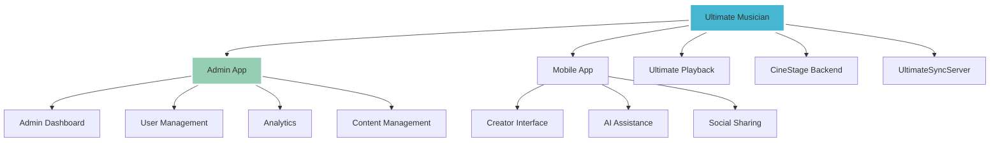

# 🎵 Ultimate Musician - Admin Overview



## 📍 Project Locations

### **Admin App**
- **Path:** `~/Library/Mobile Documents/com~apple~CloudDocs/Ultimate Ecosystem/Ultimate Musician`
- **Type:** Web-based admin interface
- **Stack:** React, TypeScript, Node.js

### **Mobile App**  
- **Path:** `~/UltimatePlatform_MONOREPO_MASTER/apps/primary_app/ultimate_musician_full_project_v3/mobile`
- **Type:** React Native mobile application
- **Features:** Music creation, AI assistance, social features

### **Ultimate Playback**
- **Path:** `~/UltimatePlatform_MONOREPO_MASTER/apps/ultimate_playback`
- **Type:** Musician playback application
- **Purpose:** Advanced playback controls and management

## 🏗️ Architecture

### **Tech Stack**
- **Frontend:** React / React Native
- **Backend:** Node.js, Cloudflare Workers
- **Database:** PostgreSQL, Redis
- **AI:** Custom ML models for music generation
- **Deployment:** Railway, Docker containers

### **Microservices Structure**
```
ultimate_musician/
├── admin-app/
├── mobile-app/
├── playback-app/
├── backend/
├── cinestage/
└── sync-server/
```

## 🎯 Features Overview

### **Admin Capabilities**
- User management and analytics
- Content moderation
- System health monitoring
- Revenue tracking
- AI model management

### **Mobile Features**
- Music creation with AI assistance
- Real-time collaboration
- Social sharing
- Cloud synchronization
- MIDI integration

### **Integration Points**
- **CineStage:** Cloudflare backend services
- **UltimateSyncServer:** MIDI bridge and sync
- **Ultimate Playback:** Advanced playback controls

## 🔗 Connection to Ultimate Ecosystem

### **Related Projects**
- [[Ultimate Pool Tech v3.0]] ← NEW addition to ecosystem
- [[Ultimate Playback - Musician Interface]]
- [[CineStage - Cloudflare Backend]]
- [[UltimateSyncServer - MIDI Bridge]]

### **Shared Patterns**
- **Cloudflare deployment** (same as Pool Tech)
- **Docker containerization** (same infrastructure)
- **Microservices architecture**
- **AI integration patterns**

## 📊 Development Status
- **Admin App:** 🔄 Active development
- **Mobile App:** 🔄 Feature enhancement
- **Backend:** ✅ Production ready
- **Integration:** ✅ CineStage connected

## 🎯 Quick Actions
- [[Open Admin App]]
- [[Check Mobile Build]]
- [[Review CineStage Backend]]
- [[Test MIDI Bridge]]

---

*Part of Ultimate Ecosystem*
*Location: ~/Ultimate Ecosystem/Ultimate Musician/*