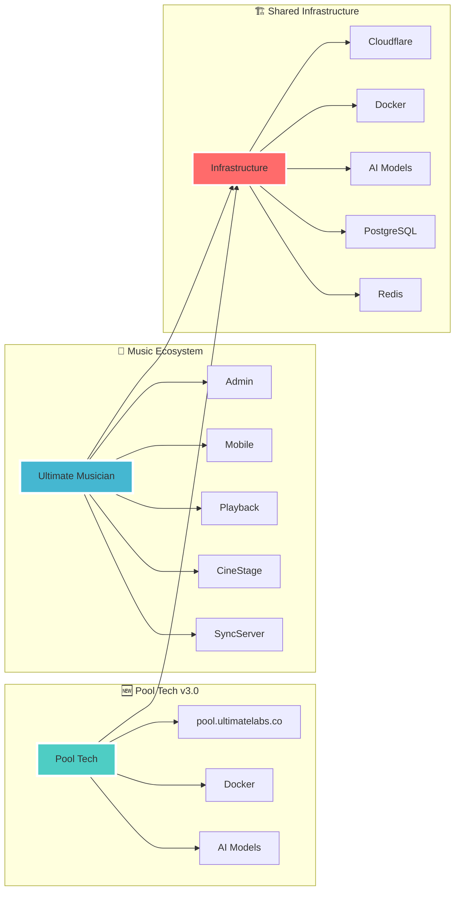

# 🔗 Ultimate Ecosystem Integration



## 🎯 Cross-Project Patterns

### **Shared Technologies**
| Technology | Pool Tech v3.0 | Ultimate Musician | Notes |
|------------|----------------|-------------------|--------|
| **Cloudflare** | ✅ Pages + Workers | ✅ Workers + CDN | Same deployment patterns |
| **Docker** | ✅ Microservices | ✅ Containers | Standardized containers |
| **PostgreSQL** | ✅ Port 5433 | ✅ Primary DB | Same database patterns |
| **Redis** | ✅ Port 6380 | ✅ Cache/Sessions | Shared caching strategy |
| **AI Models** | ✅ Mistral 7B | ✅ Custom ML | Edge AI deployment |

### **Architecture Patterns**
```
Common Patterns:
├── Microservices architecture
├── Next.js 14 frontend
├── TypeScript throughout
├── Docker containerization
├── Cloudflare global CDN
├── Railway deployment
├── GitHub repository sync
└── Edge AI processing
```

## 🚀 Integration Points

### **New Pool Tech Integration**
- **Domain:** pool.ultimatelabs.co (NEW)
- **Different focus:** Pool service vs music creation
- **Same infrastructure:** Cloudflare + Docker
- **Shared learnings:** Deployment patterns, AI integration

### **Resource Sharing**
- **GitHub:** https://github.com/xxmineiroxx-sketch/Ultimate-musician-cinestage-vault.git
- **Cloud storage:** iCloud shared documents
- **Development patterns:** Reusable across projects

## 📁 Unified Directory Structure

```
~/Library/Mobile Documents/com~apple~CloudDocs/Ultimate Ecosystem/
├── 🆕 Ultimate Pool Tech/
│   ├── pool-tech-full-system/
│   ├── LIVE: pool.ultimatelabs.co
│   └── 12 AI features
├── 🎵 Ultimate Musician/
│   ├── Admin App/
│   └── Mobile App/
├── 🎼 Ultimate Playback/
├── 🎬 CineStage/
├── 🔗 UltimateSyncServer/
└── 📊 Obsidian Vault/
    └── Ultimate Ecosystem Graph/
        ├── 🎯 ULTIMATE ECOSYSTEM INDEX.md
        ├── 🆕 Pool Tech v3.0 - Complete System.md
        ├── 🎵 Ultimate Musician - Admin Overview.md
        └── 🔗 ECOSYSTEM INTEGRATION.md
```

## 🎯 Quick Navigation

### **🆕 NEW: Pool Tech v3.0**
- **Live:** https://pool.ultimatelabs.co
- **Features:** 12 AI-powered pool service features
- **Status:** ✅ Production ready

### **🎵 Music Ecosystem**
- **Admin:** ~/Ultimate Musician/
- **Mobile:** ~/UltimatePlatform_MONOREPO_MASTER/
- **Status:** 🔄 Active development

### **🔗 Shared Resources**
- **Infrastructure:** Cloudflare + Docker patterns
- **Repository:** GitHub vault
- **Storage:** iCloud unified location

## 🔄 Synchronization Strategy

### **GitHub Sync**
- **Repository:** Ultimate-musician-cinestage-vault.git
- **Purpose:** README and documentation sync
- **Mobile apps:** Local development (not on GitHub)

### **iCloud Sync**
- **Location:** Mobile Documents/Ultimate Ecosystem/
- **Purpose:** Unified project storage
- **Access:** Cross-device development

## 🎯 Next Steps

### **Pool Tech v3.0**
- ✅ Deployed and live
- ✅ 12 features operational
- ✅ Custom domain active

### **Music Ecosystem**
- 🔄 Continue development
- 🔄 Integrate new patterns from Pool Tech
- 🔄 Apply shared infrastructure learnings

---

*Unified Ultimate Ecosystem*
*All projects interconnected through shared infrastructure and patterns*