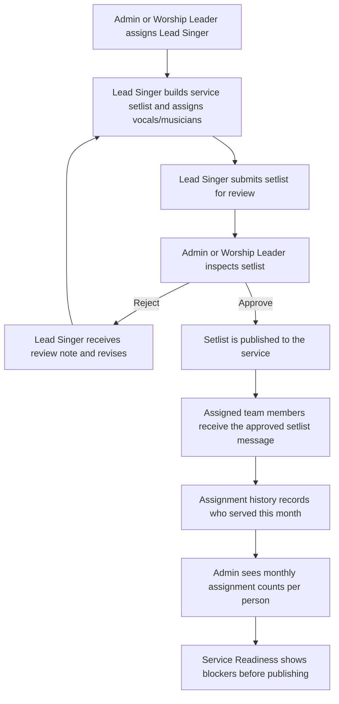

# Setlist Approval Workflow

This workflow makes CineStage/Ultimate Musician the planning brain while keeping publishing under human approval.

## Roles

- Admin: manages access, reviews setlists, approves or rejects publishing.
- Worship Leader: full Admin Panel access for services, team, library, approvals, publishing, and Lead Singer assignment.
- Lead Singer: assigned to lead a specific service, can use Calendar, Services, Team, and Library views, adds existing songs to that service setlist, assigns existing vocals/musicians, and submits it for review.
- Team Member: receives the approved setlist when assigned to the service.

## Flow

## Product Rules

- A Lead Singer cannot directly publish to the whole team.
- A Lead Singer can submit only for a service where they are assigned as Lead Singer.
- A Lead Singer cannot create or delete services.
- A Lead Singer cannot add, edit, remove, invite, or grant permissions to team members.
- A Lead Singer cannot add or remove songs from the master library; they can only add existing library songs to the assigned service setlist.
- Admin has the special authority to grant or remove Admin, Worship Leader, and Music Director access.
- Worship Leader has full operating access but cannot remove Admins or grant/remove Admin, Worship Leader, or Music Director access.
- Assigning a Lead Singer sends that singer a direct message and opens their setlist planning entry point.
- Submitting a completed setlist creates an Admin Panel message for Admin/Worship Leader inspection.
- Approval turns a pending setlist into the service plan that members receive.
- Approval creates a message for only the assigned team members.
- Rejection keeps the setlist out of the published service plan.
- Assignment tracking is recorded only when a plan is approved or directly published by an authorized planner.
- Monthly stats should help leaders rotate people fairly and avoid overusing the same members.
- Any team member can suggest a song; it stays pending until Admin/Worship Leader approves it into the library.
- Musicians can submit lyrics, chord charts, and instrument-specific notes as proposals; Admin/Worship Leader approval applies them live.
- Service Readiness should show whether the service is ready across setlist approval, team confirmations, chart completeness, proposal review, stem readiness, and desktop/cloud processing route.

## Implemented Sync Surface

- `POST /sync/grant`: grants roles and can set `canCreateSetlists`.
- `POST /sync/setlist/submit`: stores a pending setlist for review.
- `POST /sync/setlist/approve`: publishes the setlist, sends it to assigned members through sync, and records assignment history.
- `POST /sync/setlist/reject`: marks the setlist rejected with a review note.
- `POST /sync/library/song-propose`: lets any member suggest a library song.
- `GET /sync/library/pending-songs`: lists song suggestions awaiting approval.
- `POST /sync/library/song-approve`: approves a song suggestion into the library.
- `POST /sync/library/song-reject`: rejects a song suggestion.
- `POST /sync/proposal`: stores a musician lyrics/chart/instrument-note proposal.
- `POST /sync/proposal/approve`: applies an approved lyrics/chart proposal.
- `POST /sync/proposal/reject`: rejects a lyrics/chart proposal.
- `GET /sync/setlist/creators`: lists people allowed to create setlists.
- `GET /sync/setlist/pending`: lists setlists awaiting approval.
- `GET /sync/assignment-stats?month=YYYY-MM`: returns per-person assignment counts for the month.
- `GET /sync/service-readiness?serviceId=&month=YYYY-MM`: returns a normalized readiness packet with service score, blockers, assignment counts, proposal gaps, chart gaps, stem job state, and desktop/cloud route.

## Implemented App Behavior

- Admin and Worship Leader can assign Lead Singer from a service roster.
- Lead Singer sees a Setlist Planning entry point and can edit only services where they are assigned as Lead Singer.
- Lead Singer Admin Panel is limited to Calendar, Services, Team, and Library. Messages, Readiness, and Proposals stay hidden.
- Service Planner submissions include role metadata so the backend recognizes the permission.
- Admin/Worship Leader approval publishes the plan to Playback.
- Team roster management stays limited to Admin/Worship Leader roles.
- Playback Admin Dashboard now includes a Readiness tab for leaders to inspect open blockers before publishing or rehearsal.
